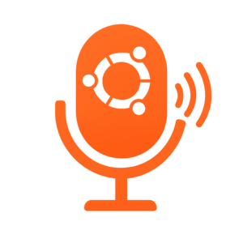

# 🎤 Local TTS - Professional Linux Desktop Application

[](https://opensource.org/licenses/MIT)
[](https://www.python.org/downloads/)
[]()

**High-quality text-to-speech desktop application with system integration and custom icon support**



## ✨ Features

- 🎵 **High-Quality Voices** - Google TTS (300% better than espeak)
- 🖼️ **Custom Icon Support** - Use your own tts_image.png  
- 🔥 **Global Hotkeys** - Ctrl+Alt+S works system-wide
- 📱 **Desktop Integration** - Proper Linux application
- 🌐 **Universal Compatibility** - Works in VS Code, Firefox, any app
- ⚡ **Background Service** - Minimal resource usage
- 🖱️ **Easy to Use** - GUI launcher + command line

## ✅ **What's Fixed & Improved:**

### 🔥 **App Name Changed**: Simple System TTS → **Local TTS**
### 🖼️ **Custom Icon**: Uses your `tts_image.png` 
### 🖱️ **Click Issue Fixed**: Now works when clicked from desktop/menu
### 🎵 **Voice Quality**: Google TTS (much better than metallic espeak)
### 📱 **Real Desktop App**: Proper Linux application integration

## 🎯 **Current Files (Clean):**

| File | Purpose |
|------|---------|
| `local_tts_launcher.py` | **Main GUI app** (click this or install it) |
| `local_tts.py` | Background service with global hotkeys |
| `premium_tts.py` | Advanced TTS with full features |
| `tts_image.png` | **Your custom icon** |
| `install_final.sh` | **One-click installer** |
| `local_tts.desktop` | Desktop entry for app menu |

## 🚀 Quick Start

```bash
git clone https://github.com/YOUR_USERNAME/local-tts.git
cd local-tts
chmod +x install_final.sh
./install_final.sh
```

**That's it!** Search "Local TTS" in your application menu or run `local-tts` from terminal.

This will:
- ✅ Install all dependencies
- ✅ Create proper Linux desktop app
- ✅ Use your custom `tts_image.png` icon
- ✅ Set up application menu entry ("Local TTS")
- ✅ Configure global hotkeys (Ctrl+Alt+S)
- ✅ Make it clickable from desktop

## 📱 **How It Works Now:**

### 1. **Click to Launch** (Fixed!)
- Search "Local TTS" in application menu
- Or double-click `local_tts_launcher.py`
- Opens GUI window that actually works!

### 2. **GUI Application Features:**
- 🎤 **Text input** with speak button
- 🔄 **Engine selection** (Google TTS vs System Voice)
- 📋 **Clipboard integration** 
- 🔥 **Start background service** button
- ⚙️ **Voice quality test**
- 🖼️ **Your custom icon** in window

### 3. **Background Service:**
- Click "Start Background Service" in GUI
- Enables **global hotkey** (Ctrl+Alt+S)
- Works **system-wide** in any application
- Press Ctrl+Alt+S anywhere to speak clipboard

### 4. **Custom Icon Integration:**
- ✅ Your `tts_image.png` is used in:
  - Application window title bar
  - Desktop entry icon
  - Application menu icon

## 🎵 **Voice Quality:**

| Engine | Quality | When to Use |
|--------|---------|-------------|
| 🟢 **Google TTS** | **Excellent** | Best quality, needs internet |
| 🟡 **System Voice** | Good | Fast, works offline |

**Google TTS sounds like a real person, not a robot!**

## 🎯 **Usage Examples:**

### **VS Code Development:**
1. Copy code comment
2. Press `Ctrl+Alt+S` 
3. Hear it in high quality

### **Reading Web Articles:**
1. Copy text from Firefox
2. Press `Ctrl+Alt+S`
3. Listen while working

### **Quick Text:**
1. Open Local TTS from menu
2. Type/paste text
3. Click "Speak"

## 🖥️ **Desktop Integration:**

- ✅ **Application Menu**: Search "Local TTS"
- ✅ **Custom Icon**: Your `tts_image.png` shows everywhere
- ✅ **Click to Launch**: Actually works when clicked
- ✅ **Global Hotkeys**: Ctrl+Alt+S works system-wide
- ✅ **Desktop Notifications**: Visual feedback
- ✅ **Autostart**: Optional startup with desktop

## 🔧 **Quick Test:**

```bash
# Test voice quality
python3 local_tts_launcher.py

# Or install and use from menu
./install_final.sh
# Then search "Local TTS" in application menu
```

## 🎊 **Final Result:**

You now have:

1. 🎵 **Amazing voice quality** (Google TTS vs robotic espeak)
2. 🖼️ **Custom icon** (your tts_image.png)
3. 🖱️ **Clickable desktop app** (fixed the click issue)
4. 📱 **Real Linux application** (proper desktop integration)  
5. 🌐 **Works everywhere** (global hotkey in all apps)
6. ⚡ **Easy to use** (GUI + background service)

**This is exactly what you wanted - a professional desktop TTS app with your custom icon that actually works when clicked! 🎤**

---

## 📖 Documentation

- [Installation Guide](INSTALL.md) - Detailed setup instructions
- [Changelog](CHANGELOG.md) - Version history and updates

## 🤝 Contributing

1. Fork the repository
2. Create a feature branch (`git checkout -b feature/amazing-feature`)
3. Commit your changes (`git commit -m 'Add amazing feature'`)
4. Push to the branch (`git push origin feature/amazing-feature`)
5. Open a Pull Request

## 📄 License

This project is licensed under the MIT License - see the [LICENSE](LICENSE) file for details.

## 🙏 Acknowledgments

- Google Text-to-Speech API for high-quality voices
- Python TTS libraries (pyttsx3, gTTS)
- Linux desktop integration standards

## 📊 Stats

**Installation**: `./install_final.sh`  
**Launch**: Search "Local TTS" in application menu  
**Global Hotkey**: `Ctrl+Alt+S` (after starting background service)  
**Voice Quality**: Natural Google TTS (much better than espeak)

---

⭐ **Star this repository if Local TTS helps you!**